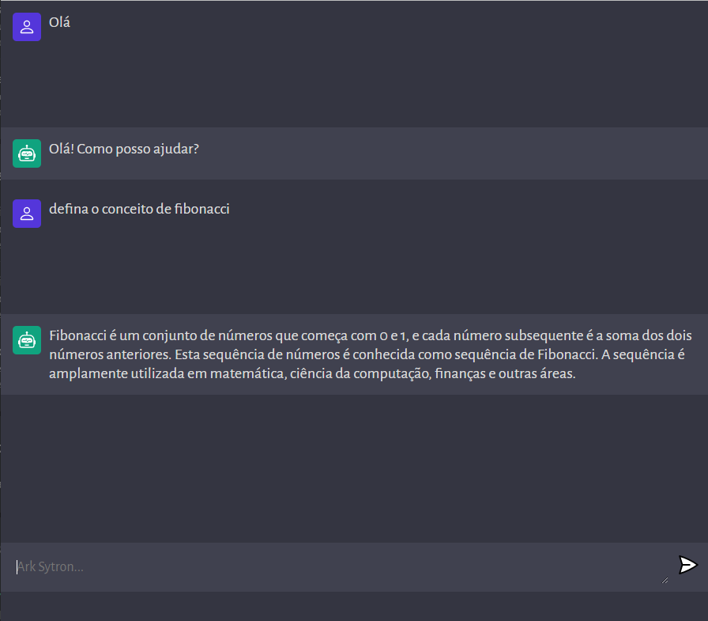

# Sytron-I.A.

Este é um projeto feito sob mentoria de [JavascriptMastery](https://github.com/adrianhajdin) onde utilizo a API da OpenAI para usufruir de uma versão mais simples do
ChatGPT.

## Demonstração

Veja uma demonstração do projeto em: [Sytron-I.A.](https://sytron-i-a.vercel.app/)

## Instalação

Para instalar as dependências necessárias para este projeto, execute o seguinte comando: `npm install`,
em seguida na pasta `client`, execute o comando `npm run dev` depois na pasta `server`, execute o comando `npm run server`, 
em seu navegador acesse usando a url `http://localhost:[PORT]/`

## Exemplos de uso

- Pode ser usado para corrigir códigos
- Responder perguntas dos mais variados assuntos
- Ajudar nos estudos de desenvolvimento em geral
- outros mais...

## Contato

Se você tiver alguma dúvida ou sugestão, sinta-se à vontade para me contatar pelo e-mail: antonio-ramon-dev@outlook.com ou pelo Twitter @Ramon2028.
